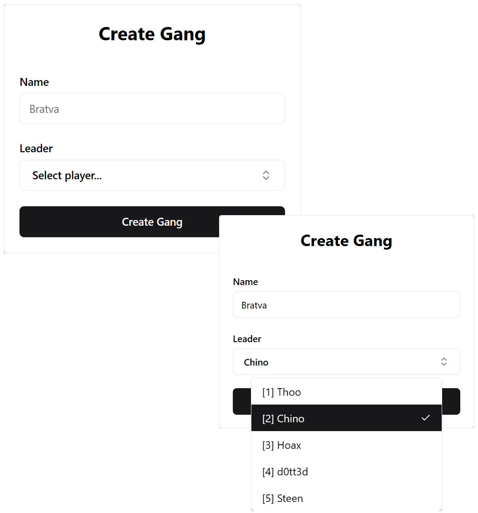

<div align="center">
  <h1>React FiveM Starter Template</h1>
  <p>A starter template for creating FiveM scripts with React, Vite, Tailwind CSS, and ShadeCN</p>
  
</div>

## Features

- ✨ Modern and fast development using [Vite](https://vitejs.dev/)
- ⚡ Full browser support with NUI mock data.
- 🚀 UI development with [React](https://reactjs.org/) and [Tailwind CSS](https://tailwindcss.com/)
- 🎨 Modern and customizable UI library [ShadCN](https://ui.shadcn.com/)
- ⚙️ Easily create beatiful and fast UI's for yor FiveM projects
- 🔧 Pre-configured build tools and settings

## Getting Started

Follow these steps to set up and start using the 'react-fivem' template:

We Recommend using [pnpm](https://pnpm.io/installation#on-windows), but you can use every package manager you prefer.

1. **Clone the repository:**

   ```bash
   git clone https://github.com/Cfx-Store/react-fivem.git
   cd react-fivem
   ```

2. **Running the project**

   ```bash
   pnpm start # For running in browser to test your UI.
   pnpm start:game # For running in FiveM itself.
   ```

3. **Building the project**

   ```bash
   pnpm i
   pnpm build
   ```

## Guide

**Showing the NUI:**

```tsx
import { useVisibility } from "@/context/visibility-context";

export function Component() {
  const { setVisible } = useVisibility();

  return <button onClick={() => setVisible(true)}>Show</button>;
}
```

**Hiding the NUI**

For hiding the UI, we can't use `setVisible` since this will only hide the frame but not disable the NUI focus and cursor ingame. Therefore we need to use the `hide` method.

```tsx
import { useVisibility } from "@/context/visibility-context";

export function Component() {
  const { hide } = useVisibility();

  return <button onClick={() => hide()}>Show</button>;
}
```

**Fetching and Events**

```lua
RegisterNUICallback("getVehicleSpeed", function(_, db)
  cb(vehicleSpeed)
end)

SendReactMessage("setVehicleSpeed", vehicleSpeed)
```

```tsx
import { fetchNui } from "@/lib/nui";

export function Speed() {
  const [speed, setSpeed] = useState<number | null>(null);

  // Fetch the current speed
  useEffect(() => {
    // The third argument (60) is the moch data, so we can run this in browser and still show the data.
    fetchNui<number>("getVehicleSpeed", {}, 60).then(setSpeed);
  }, []);

  // Listen for setVehicleSpeed events
  useNuiEvent<boolean>("setVehicleSpeed", setSpeed);

  return <span>Speed: {speed}</span>;
}
```

### Contribution

Any type of contribution is greatly appreciated.

### License

This project is licensed under the [MIT License](https://github.com/Cfx-Store/react-fivem/blob/main/LICENSE).
